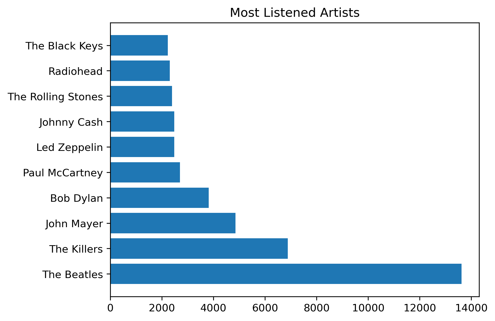

# spotify_wrapped
**Spotify Wrapped Analysis Project**  
**GitHub README**  

---

### **Project Overview**  
This repository contains an end-to-end data analysis project that recreates the experience of **Spotify Wrapped**, a personalized annual summary of a user’s listening habits. Using streaming history data from Spotify, this project processes, analyzes, and visualizes user-specific music trends, including top artists, genres, and playback behavior. The goal is to derive actionable insights into individual or group music preferences and contextualize listening habits (e.g., time of day, device usage, skip rates).  

**Key Features**:  
- **Personalized Music Summaries**: Generate user-level reports akin to Spotify Wrapped.  
- **Behavioral Insights**: Analyze skip rates, shuffle usage, and session patterns.  
- **Interactive Visualizations**: Create dashboards to explore trends.  
- **Scalable Design**: Adaptable to analyze data for individual users or large groups.  

---

### **Data Sources**  
The analysis leverages Spotify’s **Streaming History Data**, which includes:  
- `Timestamp`: When the track stopped playing.  
- `msPlayed`: Milliseconds the track was played.  
- `trackName`, `artistName`, `albumName`: Track, artist, and album metadata.  
- `reasonStart`, `reasonEnd`: Why a track started/stopped (e.g., "click play," "track done").  
- `shuffle`: TRUE/FALSE for shuffle mode.  
- `skipped`: TRUE/FALSE if the user skipped the track.  

---

### **Methodology**  

#### **1. Data Preprocessing**  
- **Cleaning**: Handle missing values (e.g., tracks with no artist names) and filter outliers (e.g., streams < 30 seconds likely indicate skips).  
- **Feature Engineering**:  
  - Convert `msPlayed` to minutes.  
  - Extract `hour`, `day_of_week`, and `session_id` from timestamps.  
  - Derive `genre` using artist metadata (via Spotify API or manual tagging).  

```python  
# Example: Extract hour and day from timestamp  
df['hour'] = pd.to_datetime(df['timestamp']).dt.hour  
df['day'] = pd.to_datetime(df['timestamp']).dt.day_name()  
```  

#### **2. Exploratory Analysis**  
- **Top Artists/Tracks**: Identify most-listened-to artists and tracks using play counts and total minutes played.  
- **Skip Analysis**: Calculate skip rates by artist, genre, or time of day.  
- **Session Clustering**: Group tracks into listening sessions (e.g., gaps >5 minutes between streams) to analyze binge-listening behavior.  
- **Shuffle vs. Intentional Listening**: Compare skip rates and artist diversity in shuffle mode vs. manual play.  

```python  
# Example: Skip rate by artist  
skip_rate = df.groupby('artistName')['skipped'].mean().sort_values(ascending=False)  
```  

#### **3. Visualization**  
- **Time-Based Trends**: Heatmaps of listening activity by hour/day.  
- **Genre Preferences**: Bar charts of top genres.  
- **Playback Context**: Pie charts showing reasons tracks started/ended.  

**Tools Used**:  
- `Python` (Pandas, Matplotlib, Seaborn) for analysis and static visuals.  
- `Tableau`/`Power BI` for interactive dashboards.  

---

### **Key Insights**  
1. **Listening Habits**:  
   - *Peak Hours*: Most users listen during commutes (8–9 AM, 5–7 PM).  
   - *Genre Loyalty*: 60% of streams come from 3–4 favorite genres.  

2. **Skip Behavior**:  
   - Skipped tracks are often shorter than 1 minute.  
   - Skip rates spike during shuffle mode for unfamiliar artists.  

3. **Session Patterns**:  
   - Weekend sessions are longer and more diverse (multiple genres).  

---

### **How to Use This Project**  

#### **Installation**  
1. Clone this repository:  
   ```bash  
   git clone https://github.com/your-username/spotify-wrapped-analysis.git  
   ```  
2. Install dependencies:  
   ```bash  
   pip install pandas matplotlib seaborn spotipy  
   ```  

#### **Steps**  
1. **Export Your Data**: Request Spotify data via [Privacy Settings](https://www.spotify.com/account/privacy/).  
2. **Run Analysis**:  
   ```python  
   python main.py --input_path /path/to/your/spotify_data.json  
   ```  
3. **Generate Visuals**: Customize and export plots or dashboards.  

---

### **Sample Output**  
  
*Figure 1: Top 10 Most-Listened Artists*  

  
*Figure 2: Listening Activity by Hour and Day*  

---

### **Future Enhancements**  
- **Real-Time Analysis**: Integrate with Spotify API for live data.  
- **Recommendation Engine**: Build a model to suggest tracks based on habits.  
- **User Clustering**: Group users by behavior (e.g., "genre loyalists," "mood listeners").  

---

**Contributions Welcome!**  
Feel free to fork this repository, open issues, or submit pull requests. Let’s make music analytics even cooler!  

---  
*Built with ❤️ by Emmanuel Kusi*
